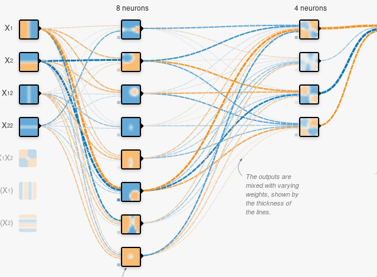
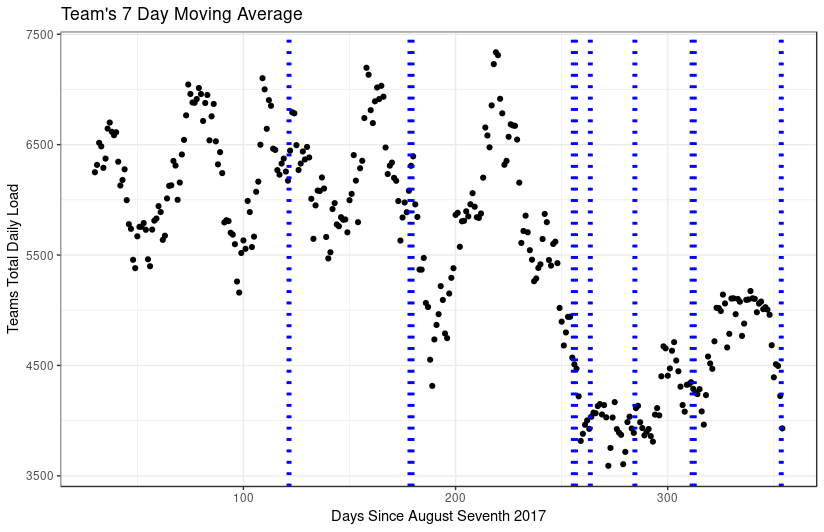

```{r setup, include=FALSE}
knitr::opts_chunk$set(echo = TRUE)
library(tidyverse)
source("IndividualMetrics.R")
```

## Abstract

The way in which a team trains is critical in ensuring that everyone performs at their peak performance during a game. In order to effectively train a team to optimize their gameday performance, it would make intuitive sense to monitor their training data with respect to their perceived fatigue. Through analyzing time series data provided by our partnering women’s rugby team, it was observed that this team altered their training schedule close to games. Although there is some relationship between the two in the long run, our attempts at modeling fatigue and work load in the short run suggests little to no correlation using linear regressions. This suggests that modeling fatigue is a more complex problem including a slew of factors both psychological and physical which spans over a period of time; coaches should pay attention not only to training but also sleep and mental wellness for happy and competitive teams. To most effectively forecast an individual's performance during a game, we propose a system which takes into account physiological factors such as desire and physical factors such as sleep, soreness and amount of training.


## Introduction

In late March of 2019, we partook in the Datafest competition co-sponsored by Rochester Institute of Technology (RIT), American Statistical Association (ASA), and Google. A dataset of around seventy million bytes was provided by a partnering organization, including but not limited to tracking of athletes’ self-rated measures on wellness, training routine workload and types, results of games, and global positioning systems, over a time span of 355 days. We were tasked to find insights that would improve understanding of training, fatigue, and performance in women’s rugby.


## Related Work

[1]. Edwards BJ, Waterhouse J.Effects of one night of partial sleep deprivation upon diurnal rhythms of accuracy and consistency in throwing darts.Chronobiol Int.2009;26:756–768.

This research explores the psychomotor effects of sleep deprivation on a subject’s performance the following day. It finds that subjects who experience sleep loss display significantly reduced coordination and alertness throughout the entire following day, leading to negative impacts on performance.

[2] Mah CD, Mah KE, Kezirian EJ, et al..The effects of sleep extension on the athletic performance of collegiate basketball players.Sleep.2011;34:943–950.

This research investigates the effect of increased sleep on an athlete's performance. It explores their performance during practices and games, and found that after increasing their sleep to approximately 10 hours per night the athletes demonstrated faster timed sprints, higher shooting accuracy, and overall improved ratings of mental and physical well-being.


## Methodology

We employed a wide range of techniques for establishing our models and hypotheses, including smoothing of time series Information, testing of hypotheses based on a priori understanding of the domain, plotting and visually analyzing pairs of variables, and artificial intelligence algorithms that found various linear and nonlinear patterns in the dataset. Coefficients of determination were calculated to determine fitness of linear models, and F1 scores were analyzed to validate complex nonlinear classification models. 

## Findings

### Fatigue and Workload

Despite intuition to the contrary, there is little relationship between different metrics of workload and fatigue. This is shown using dot plotting, and R^2 score of linear models between metrics of fatigue and workload provided in the dataset or calculated using industry standards. Some of the metrics we used include self-rated fatigue, 7 day moving averages of workload, acute load, and acute/chronic ratios. Self reported metrics were centered around zero for each player using a $log(x + sqrt(x^2 + 1))$ as a transformation. This helps us compare the relative score of these metrics between teammates. 

```{r, echo=F, out.width="50%", fig.align="default", results='hide', message=FALSE, warning=FALSE}
ggplot(data = massiveTibble, aes(x = DailyLoad, y = fatigueNorm, label=sorenessNorm)) +
  stat_smooth_func(geom="text",method="lm",hjust=0,vjust=-2,parse=TRUE) +
  geom_smooth(method="lm",se=FALSE) +
  labs(x = "Daily Load", y = "Normalized Fatigue Sccore")+ 
  theme_bw() +
  ylim(-6,4) +
  ggtitle("Daily Work Load vs Fatigue") + 
  geom_point()


ggplot(data = massiveTibble, aes(x = acuteChronicRatioSliding, y = fatigueNorm, label=sorenessNorm)) +
  stat_smooth_func(geom="text",method="lm",hjust=0,vjust=-2,parse=TRUE) +
  geom_smooth(method="lm",se=FALSE) +
  labs(x = "Acute Chronic Ratio Smoothed Data", y = "Normalized Fatigue Sccore")+ 
  theme_bw() +
  ylim(-6,4) +
  geom_point() +
  ggtitle("Acute Chronic Ratio vs Fatigue")
```

### Psychological and Physiological Factors of Fatigue

There exists relationships between sleep, fatigue, soreness, irritability, and desire, most likely due to connections between rest, motivation, and physical preparedness. This is shown using plotted lines of best fit, $R^2$ scores, and sample sizes, for both bivariate regressions. 


```{r, echo=F, out.width="50%", fig.align="default", results='hide', message=FALSE, warning=FALSE}
ggplot(data = massiveTibble, aes(x = sleepQualityNorm, y = fatigueNorm, label=sorenessNorm)) +
  stat_smooth_func(geom="text",method="lm",hjust=0,vjust=-1,parse=TRUE) +
  geom_smooth(method="lm",se=FALSE) +
  labs(x = "Normalized Sleep Quality", y = "Normalized Fatigue Sccore")+ 
  theme_bw() +
  ylim(-6,4) +
  ggtitle("Sleep Quality vs Fatigue") + 
  geom_point()

ggplot(data = massiveTibble, aes(x = sorenessNorm, y = fatigueNorm, label=sorenessNorm)) +
  stat_smooth_func(geom="text",method="lm",hjust=0,vjust=-1,parse=TRUE) +
  geom_smooth(method="lm",se=FALSE) +
  labs(x = "Normalized Soreness", y = "Normalized Fatigue Sccore")+ 
  theme_bw() +
  ylim(-6,4) +
  ggtitle("Soreness vs Fatigue") + 
  geom_point()
```


### Modeling Fatigue

Fatigue can be effectively and linearly modeled using daily records and time series moving averages of acute chronic ratios, daily workload, sleep quality, and sleep hours. This means that instead of only lowering training before competitions, coaches should put focus on preparing the athletes physically and mentally through a combination of measures with a focus on sleep.


| Iterations/100      | Mean Squared Error |
| ----------- | ----------- |
| 1      | 90.4998       |
| 11   | 1.0265        |
| 21   | 0.9604        |
| 31   | 0.8671        |
| 41   | 0.7838        |
|100 | 0.0925 |
Sample Size: 304864
Final R2: 0.532


### Predicting Performance

Trivially, performance of an individual cannot be modeled using simple linear regressions only involving one factors. We therefore developed and optimized a deep neural network to capture the patterns involving fatigue, sleep, and self-rated performance. 

The structure of the network is a 3-layer (input, output, and a hidden layer) sigmoid classifier that was trained on batches of 32 samples from players with respect to features: normalized perceived fatigue, sliding average of perceived fatigue, sliding average over sleep hours, and the perceived sleep quality of the players. It is optimized through the Adam optimizer with a learning rate of .005 and cross entropy to calculate the loss between the logits and labels. See figure 1 to see the structure of our network.
   
The logits of the work are a confidence output on which class the network feels the sample most likely belongs to, the real value of which is the classification of perceived performance by the player. Through this method, we can show a correlation between fatigue, sleep, and self-rated performance, as well as a means to predict this self-rate performance based off of fatigue and self-perceived sleep quality.


Results with LR=.01, Batch=32:

- Accuracy before training: 20.44388%
- Loss after step 49: .531657
- Accuracy after training: 74.846625%
- F1 Score: .94





### Fatigue and Training Over a Season

The following graphs (Figure 2) shows the exponentially smoothed total workload of the team throughout the season. Vertical lines were used highlight when there were games. Looking at the graph it can be observed that the team trains a lot during the preseason and then tappers their training when a game nears.





## Future Work

With more data to to test with we can further improve and validate out models. With historical
data from other teams we can take our analysis one step further. Based on the training,
performance, and fatigue information from other teams we can use that to create a model to
make a recommendation for our team’s training. This model would be able to make
recommendations for our training intensity leading up to a game. Since this will be heavilydealing with multivariate time series data leading up to a game, using a Long Short-term
Network (LSTM) would bring promising results.